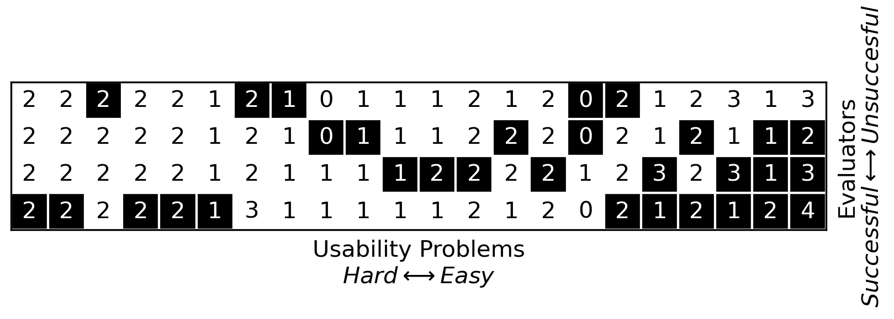

# Graph Nielsen Heuristics Results
This program parses a text file containing the results of an Nielsen heuristics usability evaluation. The format used for the evaluation is the following:

```
 (Who found the problem+) (Problem description) -> ((evaluation 1-4 using the same order as at the top of this document)+)
```

This program uses the result from the parser to create a graph of the results. The graph is created using matplotlib and is very similar to the one presented in the official Nielsen Norman Group (page)[https://www.nngroup.com/articles/how-to-conduct-a-heuristic-evaluation/theory-heuristic-evaluations/] about the technique.
# Results parsing
An example.txt file is included in the repository and was created when I was writing my master dissertation. The header of the file, including instructions for the evaluators, was removed as to not over complicate the parser.

# Usage
The programs dont require / use any cli arguments. 
The resultsParser, when directly executed, will parse a file named example.txt and print the resulting array of problems to the console. The result for the provided example is:
```
[(('Emanuel', 'Mohannad', 'David'), (2, 1, 1, 1)), (('Mohannad',), (2, 2, 2, 2)), (('Gil', 'Emanuel'), (0, 1, 0, 0)), (('Mohannad',), (2, 2, 2, 2)), (('Gil',), (2, 2, 2, 2)), (('Mohannad',), (2, 2, 2, 2)), (('Gil', 'Mohannad'), (2, 2, 2, 2)), (('Mohannad',), (2, 2, 2, 2)), (('Mohannad',), (1, 1, 1, 1)), (('Mohannad', 'Emanuel', 'David'), (4, 3, 2, 3)), (('Gil',), (3, 2, 2, 2)), (('Gil',), (1, 1, 1, 1)), (('Mohannad', 'David'), (1, 3, 1, 1)), (('Emanuel', 'Mohannad'), (2, 2, 2, 2)), (('Emanuel',), (1, 1, 0, 0)), (('Emanuel',), (1, 1, 1, 1)), (('David',), (1, 1, 1, 1)), (('David',), (1, 2, 1, 1)), (('David', 'Mohannad'), (1, 3, 1, 3)), (('David',), (2, 2, 2, 2)), (('Emanuel',), (1, 2, 2, 1)), (('David',), (2, 2, 2, 2))]
```
The createGraph program, when directly executed, will create a graph using the results from resultsParser file. The graph will be saved as a png file named graph.png. The graph for the provided example is:
